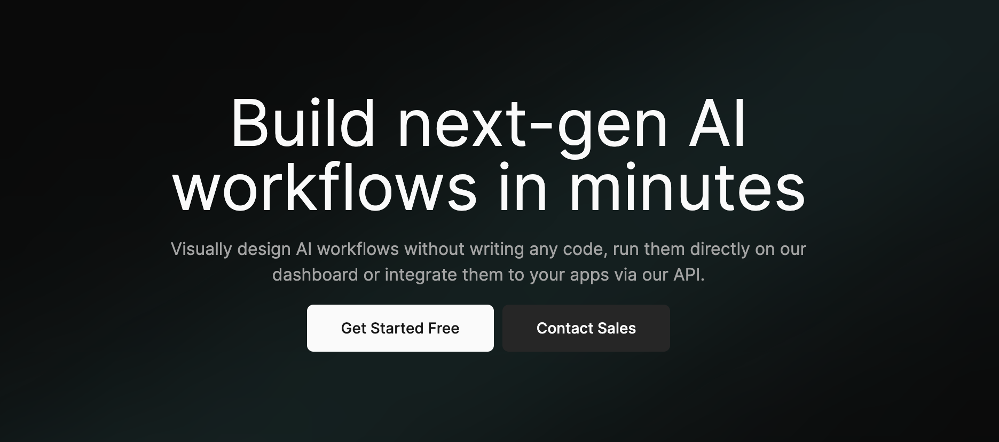

<div align="center">

[](https://www.tryleap.ai/)

# [Leap Workflows](https://www.tryleap.ai/)<a id="leap-workflows"></a>

The Leap Workflows API allows developers to run workflows, fetch workflow runs, and provide other utility functions related to workflow runs. Please use the X-Api-Key for authenticated requests.

[](https://www.npmjs.com/package/@leap-ai/workflows/v/1.1.0)
[](https://tryleap.ai/)

</div>

## Table of Contents<a id="table-of-contents"></a>

<!-- toc -->

- [Installation](#installation)
- [Getting Started](#getting-started)
- [Reference](#reference)
  * [`leap.workflowRuns.getWorkflowRun`](#leapworkflowrunsgetworkflowrun)
  * [`leap.workflowRuns.workflow`](#leapworkflowrunsworkflow)

<!-- tocstop -->

## Installation<a id="installation"></a>

<table>
<tr>
<th width="292px"><code>npm</code></th>
<th width="293px"><code>pnpm</code></th>
<th width="292px"><code>yarn</code></th>
</tr>
<tr>
<td>

```bash
npm i @leap-ai/workflows
```

</td>
<td>

```bash
pnpm i @leap-ai/workflows
```

</td>
<td>

```bash
yarn add @leap-ai/workflows
```

</td>
</tr>
</table>

## Getting Started<a id="getting-started"></a>

```typescript
import { Leap } from "@leap-ai/workflows";

const leap = new Leap({
  // Defining the base path is optional and defaults to https://api.workflows.tryleap.ai
  // basePath: "https://api.workflows.tryleap.ai",
  apiKey: "API_KEY",
});

const getWorkflowRunResponse = await leap.workflowRuns.getWorkflowRun({
  workflowRunId: "workflowRunId_example",
});

console.log(getWorkflowRunResponse);
```

## Reference<a id="reference"></a>


### `leap.workflowRuns.getWorkflowRun`<a id="leapworkflowrunsgetworkflowrun"></a>

This endpoint retrieves the details of a specific workflow run using its `workflow_run_id`.

#### 🛠️ Usage<a id="🛠️-usage"></a>

```typescript
const getWorkflowRunResponse = await leap.workflowRuns.getWorkflowRun({
  workflowRunId: "workflowRunId_example",
});
```

#### ⚙️ Parameters<a id="⚙️-parameters"></a>

##### workflowRunId: `string`<a id="workflowrunid-string"></a>

The ID of the workflow run to retrieve.

#### 🔄 Return<a id="🔄-return"></a>

[WorkflowRunEntity](./models/workflow-run-entity.ts)

#### 🌐 Endpoint<a id="🌐-endpoint"></a>

`/v1/runs/{workflow_run_id}` `GET`

[🔙 **Back to Table of Contents**](#table-of-contents)

---


### `leap.workflowRuns.workflow`<a id="leapworkflowrunsworkflow"></a>

This endpoint lets the user run a specified workflow with the provided workflow definition.

#### 🛠️ Usage<a id="🛠️-usage"></a>

```typescript
const workflowResponse = await leap.workflowRuns.workflow({
  workflow_id: "wkf_i3F5UjpZ2Vg",
  webhook_url: "https://myapp.com/webhook",
});
```

#### ⚙️ Parameters<a id="⚙️-parameters"></a>

##### workflow_id: `string`<a id="workflow_id-string"></a>

The ID of the workflow to be run.

##### webhook_url: `string`<a id="webhook_url-string"></a>

The URL to which the workflow results should be sent to on completion.

##### input: `{ [key: string]: any; }`<a id="input--key-string-any-"></a>

Variables that the workflow can use globally and their values.

#### 🔄 Return<a id="🔄-return"></a>

[WorkflowRunEntity](./models/workflow-run-entity.ts)

#### 🌐 Endpoint<a id="🌐-endpoint"></a>

`/v1/runs` `POST`

[🔙 **Back to Table of Contents**](#table-of-contents)

---


## Author<a id="author"></a>
This TypeScript package is automatically generated by [Konfig](https://konfigthis.com)
